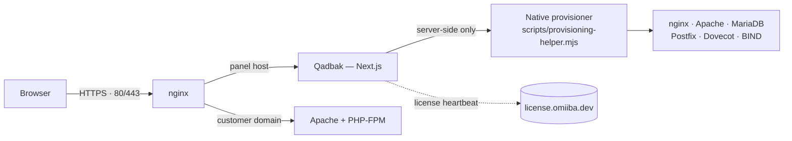

<div align="center">

# Qadbak

### Self-hosted hosting control panel for Ubuntu VPS.

Admin and client UI for domains, mail, DNS, TLS, databases, backups, and cron — on **your** server. Open-source core; Premium for resellers, webmail, and white-label.

[](https://opensource.org/licenses/Apache-2.0)
[](https://github.com/macdirtycow/qadbak/releases)
[](docs/LINUX-SUPPORT.md)
[](docs/LINUX-SUPPORT.md)
[](https://nodejs.org)
[](https://nextjs.org)
[](https://qadbak.com/#pricing)
[](https://omiiba.dev)

[**Website**](https://qadbak.com) ·
[**Pricing**](https://qadbak.com/#pricing) ·
[**Buy a license**](https://license.omiiba.dev/buy) ·
[**Check a license**](https://license.omiiba.dev) ·
[**Docs**](docs/) ·
[**About the name**](docs/ABOUT-THE-NAME.md)

</div>

---

## What is Qadbak?

Qadbak is a self-hosted hosting control panel. You install it on a fresh Ubuntu VPS,
sign in, and manage every site, mailbox, DNS record and database from one English
UI — with a clean split between administrators (who run the host) and clients
(who only see their own domains).

It's the alternative for people who want **cPanel-class workflows** without
cPanel's price tag, license server, or 2010 UI.

```bash
git clone https://github.com/macdirtycow/qadbak.git /opt/qadbak
cd /opt/qadbak
sudo bash install/qadbak-install.sh
```

Three prompts (hostname, admin password, Let's Encrypt email) and you're done.

## Features

### Core (open source)

| Area | What you get |
|------|--------------|
| **Domains** | Sites, subdomains, aliases, redirects, reverse proxies. |
| **Mail** | Mailboxes, forwarding, SPF/DKIM/DMARC helpers, delivery logs. |
| **DNS** | BIND9 records + registrar checklist for clients. |
| **TLS** | Let's Encrypt with per-host renewal status. |
| **Databases** | MariaDB per domain, phpMyAdmin shortcut. |
| **Files & terminal** | File manager and shell as the **domain unix user**. |
| **PHP** | Version switching and per-user PHP-FPM pools. |
| **Backups** | Downloadable archives: files, **all mailboxes**, panel settings, DNS zone, certs, crontab. |
| **Operations** | Action journal, undo (mail/DNS), health checks, WordPress install flow. |
| **Cron** | Scheduled jobs with plain-language editor. |
| **Security** | ModSecurity WAF toggle, ClamAV scans, admin firewall UI. |
| **Runtimes** | Node, Python, Docker compose beside PHP-FPM per domain. |
| **Apps** | One-click catalog installs into `public_html`. |
| **Backups+** | Offsite S3/B2/GCS, browse archive, restore single files or DB. |
| **Monitoring** | Metrics history, alert rules (email / Slack / Telegram). |
| **API v1** | Bearer keys with scopes — domains, mail, DNS, SSL, suspend, backups. |
| **Billing** | WHMCS module + Blesta starter in `integrations/`. |
| **Panel URLs** | `panel.<domain>` vhosts + Cloudflare Flexible/Full — [CLOUDFLARE.md](docs/CLOUDFLARE.md). |

### Premium (license key)

| Module | Description |
|--------|-------------|
| **Client portal & RBAC** | End customers manage only their domains. |
| **Panel vhost provisioning** | Separate panel URLs per reseller brand. |
| **Webmail** | Built-in IMAP webmail in the panel. |
| **White-label** | Logo, colours, product name. |
| **License admin** | View activations, move VPS, heartbeat status. |
| **Admin updates** | Pull and rebuild panel from the UI. |
| **Offsite backups** | Encrypted cloud credentials + per-domain upload policy. |

Website: [qadbak.com](https://qadbak.com) · Market features: [docs/MARKET-FEATURES.md](docs/MARKET-FEATURES.md)

## Pricing

| Plan | Price | Use it for |
|------|-------|------------|
| Pro · **1 month** | **€2.50/mo** | Trying things out (subscription) |
| Pro · 3 months | €7.45 | Short project |
| Pro · 6 months | €10.50 | Half-year of hosting |
| Pro · **1 year** ★ Most popular | **€20** | Annual usage |
| Pro · **3 years** | **€55** | Billed every 3 years (subscription) |

All plans cover **50 domains** on **1 VPS** with full Premium modules. Monthly
plans are **Stripe subscriptions** (renew until cancelled in Stripe). The Qadbak core panel is open source and runs without a
license — Premium unlocks the multi-tenant client modules, RBAC, panel-vhost
provisioning, per-user PHP-FPM isolation and live admin updates.

> [Buy a license →](https://license.omiiba.dev/buy) · [Check or refund an existing key →](https://license.omiiba.dev) · [Refund policy](https://qadbak.com/refund)

## Why Qadbak vs the classics?

|                                 | **Qadbak** | cPanel | Plesk | HestiaCP |
|---------------------------------|:----------:|:------:|:-----:|:--------:|
| Starting price / month          | **€2.50**  | ~€35   | ~€15  | Free     |
| 3-year subscription (€55)       | **€55**    |   ✗    |   ✗   | Free     |
| Modern web UI                   | ✅         | Legacy | Mixed | Functional |
| Admin / client role split       | ✅ Native  | WHM    | ✅    | ✅       |
| Open source                     | ✅ Apache 2.0 core |   ✗    |   ✗   | GPL      |
| EU-based vendor (GDPR)          | 🇳🇱 NL   |  🇺🇸  | EU+US | EU       |
| Activation in <1 minute         | Email key  | License srv | License key | Install only |

## Quick start (local dev)

```bash
git clone https://github.com/macdirtycow/qadbak.git
cd qadbak
cp .env.example .env.local
npm install
npm run dev          # http://localhost:3000
```

On first start `data/users.json` is created from `data/users.example.json`:

| User | Default password | Role |
|------|-----------------|------|
| `admin` | `changeme` | administrator |
| `client` | `changeme` | client (mock domain `example.com`) |

Hash your own password before sharing:

```bash
node scripts/hash-password.mjs your-password
```

## Install on a VPS

**Requirements (full stack):** Ubuntu 22.04/24.04/26.04 or Debian 12, root, DNS A-record, 1 GB+ RAM. **Panel-only:** any Linux with Node 20+ — see [docs/LINUX-SUPPORT.md](docs/LINUX-SUPPORT.md).

```bash
git clone https://github.com/macdirtycow/qadbak.git /opt/qadbak
cd /opt/qadbak
sudo bash install/qadbak-install.sh
```

The installer:
1. Installs nginx, Apache, MariaDB, Postfix, Dovecot, BIND, PHP-FPM, certbot.
2. Clones Qadbak to `/opt/qadbak`, runs `npm install && npm run build`.
3. Creates the system user `qadbak`, sets up pm2 + systemd.
4. Generates a `SESSION_SECRET`, writes `/opt/qadbak/.env.local`.
5. Asks once for your admin password and writes `data/users.json`.
6. Optionally issues a Let's Encrypt certificate for the panel host.
7. Runs `post-install-verify.sh` (preflight + API + optional Playwright E2E).

When it's done, open `https://your-panel-host/login`.

### Resume a partial install

```bash
sudo bash /opt/qadbak/install/qadbak-install-resume.sh
```

### Update on the server

```bash
cd /opt/qadbak && sudo bash scripts/update-qadbak.sh
```

Panel unreachable after update (Cloudflare **520** or `panel.<domain>`):

```bash
sudo bash /opt/qadbak/scripts/fix-panel-now.sh
sudo bash /opt/qadbak/scripts/diagnose-panel-access.sh panel.example.com
```

That's the whole update flow for both Core and Premium customers. The
panel is **open-core**: Premium source lives in this repo and is gated
purely by `isPremiumFeatureEnabled()` against the license server's
feature list — there is no encrypted artifact to download and no
second activation step. `git pull && npm run build && pm2 restart` is
equivalent under the hood.

### Bought a Premium license on an existing install?

One-shot pull + rebuild + activate:

```bash
sudo bash /opt/qadbak/scripts/buy-premium.sh QAD-XXXX-YYYY-ZZZZ-WWWW
```

### Uninstall

```bash
sudo bash /opt/qadbak/install/qadbak-uninstall.sh           # safe default
sudo bash /opt/qadbak/install/qadbak-uninstall.sh --help    # all flags
sudo bash /opt/qadbak/install/qadbak-uninstall.sh --dry-run # preview, no changes
```

Defaults are conservative — only the Qadbak panel is removed. Use
`--remove-stack` / `--remove-customers` for a full wipe (test VPS only).

## Architecture



- **Auth:** JWT (httpOnly cookie), users in `data/users.json`.
- **RBAC:** `src/lib/rbac.ts` + `src/lib/features.ts`.
- **Domains:** `data/native-domains.json` + host helpers.
- **Audit log:** `data/audit.log`.
- **Self-host first:** all sites, mail and DBs live on YOUR VPS. The only
  outbound call is a small license heartbeat — see [Privacy](https://qadbak.com/privacy).

## Project layout

```
src/app/          Next.js routes (UI + API)
src/lib/          provisioner, auth, RBAC, domain helpers
src/components/   UI per domain / admin
scripts/          install, native helpers, update, tests
install/          qadbak-install.sh, qadbak-uninstall.sh
deploy/           nginx examples
docs/             guides and checklists
data/             users.example.json (template)
marketing-site/   static HTML for qadbak.com + legal pages
```

## Documentation

| File | Contents |
|------|----------|
| [docs/QADBAK-NATIVE-INSTALL.md](docs/QADBAK-NATIVE-INSTALL.md) | Native VPS install in depth |
| [docs/V1-TEST-SERVER.md](docs/V1-TEST-SERVER.md) | Step-by-step test server |
| [docs/UBUNTU-24-LTS.md](docs/UBUNTU-24-LTS.md) | Ubuntu version notes |
| [docs/PHASE-8-INDEPENDENT.md](docs/PHASE-8-INDEPENDENT.md) | Independent native mode |
| [docs/E2E-CHECKLIST.md](docs/E2E-CHECKLIST.md) | Sign-off checklist |
| [docs/PHASES.md](docs/PHASES.md) | Feature phases |
| [docs/MARKET-FEATURES.md](docs/MARKET-FEATURES.md) | Market competition phases 1–8 |
| [docs/CLOUDFLARE.md](docs/CLOUDFLARE.md) | Cloudflare 502/520 + panel SSL |
| [docs/integrations/WHMCS-INTEGRATION.md](docs/integrations/WHMCS-INTEGRATION.md) | WHMCS + API v1 |
| [docs/api/openapi.yaml](docs/api/openapi.yaml) | REST API v1 OpenAPI |
| [docs/HOSTING-NGINX.md](docs/HOSTING-NGINX.md) | nginx + Apache for sites |
| [docs/TERMINAL-NATIVE.md](docs/TERMINAL-NATIVE.md) | In-panel terminal |
| [docs/MIGRATE-FROM-LEGACY-HOSTING.md](docs/MIGRATE-FROM-LEGACY-HOSTING.md) | Migrate from another panel |
| [docs/ABOUT-THE-NAME.md](docs/ABOUT-THE-NAME.md) | Why "Qadbak" |

## Common commands

| Command | Purpose |
|---------|---------|
| `npm run dev` | Development server (mocked native ops) |
| `npm run build` | Production Next.js build |
| `npm run test-api` | API + domain-registry sanity check |
| `npm run preflight` | VPS checks (env, ports, services) |
| `bash scripts/update-qadbak.sh` | Pull + build + restart pm2 |
| `sudo bash install/qadbak-install.sh` | Fresh VPS install |
| `sudo bash install/qadbak-uninstall.sh` | Remove the panel cleanly |

## Marketing site (qadbak.com)

Pricing, feature copy, and **live demo** CTAs live in `marketing-site/`. The panel serves them at `/` via
`npm run build` (runs `scripts/sync-landing-public.sh` for CSS/JS assets).

**Live demo:** [demo.qadbak.com](https://demo.qadbak.com/login) — enable on your VPS with
`sudo bash scripts/apply-demo-vhost.sh` ([docs/DEMO.md](docs/DEMO.md)).

**After changing prices or terms**, redeploy so qadbak.com updates:

```bash
cd /opt/qadbak && git pull && sudo -u qadbak npm run build
sudo bash scripts/pm2-restart-qadbak.sh
```

Static-only host (no Next.js): rebuild and upload the zip:

```bash
bash scripts/build-marketing-zip.sh   # dist/qadbak-site-upload.zip
```

Static pages included: landing, about, privacy, terms, refund. Checkout prices
always come from `license.omiiba.dev/buy` (license-server repo).

## Contributing

External pull requests are accepted for bug fixes and documentation only — see
[CONTRIBUTING.md](CONTRIBUTING.md). New features are scoped through GitHub
issues first.

Security disclosures: please email **security@omiiba.dev** rather than opening
a public issue. See [SECURITY.md](.github/SECURITY.md).

## About the name

In 2009, [Qadbak Investments](https://en.wikipedia.org/wiki/Qadbak_Investments)
made headlines around Notts County and BMW Sauber F1 — later remembered as hype
without substance. This panel reuses the name for the **opposite**: working
code on **your** server (not affiliated with that entity). Full story:
[docs/ABOUT-THE-NAME.md](docs/ABOUT-THE-NAME.md) or `/about` inside the panel.

## License

**Apache License 2.0.** Copyright © 2026 MacDirtyCow / Qadbak and Omiiba.

The Qadbak core panel is open source under the Apache 2.0 License. You can
install, self-host, modify, and use it commercially without paying anything.
Premium modules (multi-tenant clients, per-user PHP-FPM isolation, live admin
updates, RBAC, reseller plans) remain a paid add-on gated by a runtime
license-key heartbeat — see [COMMERCIAL-LICENSING.md](COMMERCIAL-LICENSING.md).

See [LICENSE](LICENSE), [COMMERCIAL-LICENSING.md](COMMERCIAL-LICENSING.md) and
[NOTICE](NOTICE).
