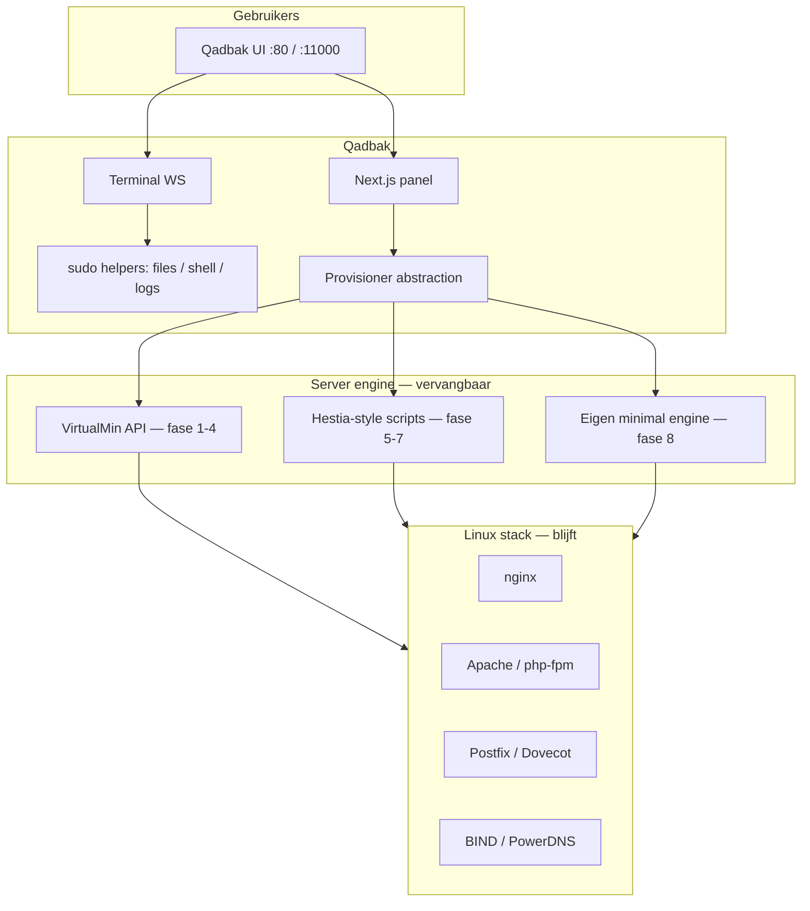

# Qadbak — 8 fasen naar onafhankelijkheid (zonder Webmin-UI)

Dit document is het **loskoppelplan**: klanten en resellers gebruiken **alleen Qadbak**; VirtualMin/Webmin verdwijnen van het dagelijks werk en uiteindelijk van de serverrol.

Zie ook: [ROADMAP.md](./ROADMAP.md) · [ROADMAP-NATIVE.md](./ROADMAP-NATIVE.md) · [PARITY-AUDIT.md](./PARITY-AUDIT.md)

---

## Is dit haalbaar?

| Doel | Haalbaar? | Opmerking |
|------|-----------|-----------|
| Klanten zien **nooit** Webmin (`:10000`) | **Ja** | 3–6 maanden met huidige API + native UI (fase 1–3) |
| **Geen** VirtualMin-API meer, alles eigen scripts | **Ja, maar groot** | 12–24+ maanden; vergelijkbaar met een eigen Hestia/ISPConfig bouwen |
| Qadbak **zonder** Apache/BIND/Postfix op de server | **Nee** | Panel bestuurt altijd een stack; alleen de **stuurlaag** wordt Qadbak |
| 1 persoon, volledige Webmin-pariteit (~90 modules) | **Onrealistisch kort** | Team of jaren; daarom 8 fasen met duidelijke “good enough” per fase |

**Conclusie:** Qadbak kan **op zichzelf bestaan als product** (UI + auth + automatisering) terwijl VirtualMin in vroege fasen **onzichtbare motor** blijft. Volledige verwijdering van VirtualMin is fase 8 en is een **bewuste migratie**, geen weekendklus.

---

## Wat andere open-source panels doen (lessen, geen fork)

| Project | Sterkte | Wat Qadbak kan overnemen |
|---------|---------|---------------------------|
| **[HestiaCP](https://github.com/hestiacp/hestiacp)** | Eén bash-API (`v-add-user`, `v-add-domain`); geen Webmin | **Script-first provisioning** achter een dunne Node-laag; duidelijke CLI-contracten |
| **[CloudPanel](https://www.cloudpanel.io)** | Modern UI, PHP/Node stack, lean | UX: snelle domein-flow, SSL in één klik |
| **[CyberPanel](https://github.com/usmannasir/cyberpanel)** | OpenLiteSpeed + API | Idee: REST voor alles; minder geschikt als jij Apache/VM stack houdt |
| **[ISPConfig](https://www.ispconfig.org)** | Multi-server, mature | Model: “remote” API naar agents op nodes |
| **[Froxlor](https://froxlor.org)** | Lichtgewicht PHP panel | Simpele domein/mail-screens; minder enterprise |
| **VirtualMin (huidig)** | Alles kan; API `remote.cgi` | Blijft **fase 1–4 engine** tot vervanging klaar is |

Qadbak hoeft Webmin **niet** te forken. Het slimste pad is:

1. **Nu:** VirtualMin API achter `virtualmin.ts` / toekomstige `provisioner/`.
2. **Later:** Hestia-achtige scripts **of** directe config (nginx, postfix, bind) per domein.
3. **Nooit:** 90 Webmin-schermen 1-op-1 nabouwen — alleen wat hosting-klanten echt gebruiken (zie [PARITY-AUDIT.md](./PARITY-AUDIT.md)).

---

## Architectuur (eindbeeld)



---

## Fase 1 — Geen Webmin in de dagelijkse workflow (nu → 4 weken)

**Doel:** Alles wat een klant op een domein doet, gaat via Qadbak; geen embeds, geen `:10000`.

| Onderdeel | Actie | Status |
|-----------|--------|--------|
| Bestanden | Alleen native `domain-fs-helper` | Grotendeels klaar |
| Terminal | Native bash + WebSocket (`qadbak-terminal`) | Code klaar; VPS: `check-terminal-ws.sh` |
| Website | nginx/Apache scripts, repair in panel | Klaar |
| Mail / DNS / SSL / DB | Bestaande native schermen + VM API | Klaar |
| Webmin-tab / embeds | Verbergen voor `client`; admin alleen waar nodig | Te doen |
| Installer | `install-hosting-stack.sh`, geen Webmin-URL in onboarding | Klaar |

**Exit:** E2E op test-VPS zonder iframe; terminal toont prompt als `siccamanagement@…`.

**Terminal nog leeg?** Op de VPS:

```bash
sudo bash /opt/qadbak/scripts/check-terminal-ws.sh
sudo -u qadbak pm2 logs qadbak-terminal --lines 20
```

---

## Fase 2 — Provisioner-laag (abstractie) ✅ in repo

**Doel:** Geen `virtualmin.ts` meer direct in API-routes; één interface om later te wisselen.

- `src/lib/provisioner/` — `getProvisioner()`, VirtualMin-adapter
- `.env`: `QADBAK_PROVISIONER=virtualmin` (later `hestia` / `native`)
- Docs: [PROVISIONER.md](./PROVISIONER.md)

**Exit:** Alle `src/app/api/**` routes + `domain-api.ts` via `getProvisioner()`. Server components migreren in fase 3.

---

## Fase 3 — Hosting-kern 100% Qadbak (VirtualMin alleen headless) ✅ in repo

**Doel:** v1-pariteit in [PARITY-AUDIT.md](./PARITY-AUDIT.md) op **UI**, niet Embed.

- Domein aanmaken/verwijderen, sub/alias, limits, lifecycle
- Mailboxen, aliases, spam/DKIM toggles
- DNS records CRUD
- SSL Let’s Encrypt + renew
- Cron, PHP, redirects, proxies
- Logs (tail via helper, geen Webmin log-viewer)

**Gedaan:** `src/app/(app)/**` + managers via `getProvisioner()`; Webmin-domeinlink `adminOnly` + redirect voor clients.

**Exit:** Geen enkele Virtualmin-sidebar-link nodig voor hosting; API mag nog VM zijn.

---

## Fase 4 — Server & reseller zonder Webmin-menu ✅ in repo

**Doel:** Admin beheert server vanuit Qadbak (status, diensten, firewall, plannen).

- Dashboard: CPU/RAM/disk (via `/proc`, `systemctl`, niet Webmin dashboard-embed)
- Diensten: nginx, apache, postfix, bind — start/stop/restart met policy
- Resellers/plannen: native forms
- Backups: scripts + S3 (bestaande richting in repo)

**Gedaan:** `AdminHostMetrics` + `/api/admin/host-metrics`; `host-services-helper` + sudo; Webmin uit header/admin-nav (break-glass link op overview); `QADBAK_SHOW_WEBMIN_NAV` voor oude menu’s.

**Exit:** Admin opent `:10000` niet meer; optioneel alleen break-glass SSH.

---

## Fase 5 — Config-bestanden + helpers (Webmin modules vervangen) ✅ in repo

**Doel:** Gevoelige bewerkingen via **gevalideerde helpers**, niet door 70 Webmin-modules.

| Domein | Aanpak | Inspiratie |
|--------|--------|------------|
| Apache vhost | Templates + `apachectl configtest` | Hestia `v-add-web-domain` |
| nginx | Per-domain vhosts (hebben jullie al) | Qadbak scripts |
| Postfix/Dovecot | Map domein → transport, mailbox files | ISPConfig patterns |
| BIND | Zone files of API (nsupdate) | Hestia DNS |
| MariaDB | `mysql` CLI + beperkte users | CloudPanel DB UI |
| Firewall | `ufw`/`firewalld` wrappers | Hestia |

**Gedaan:** `stack-helper.mjs` + sudo + `/admin/stack` + domain **Stack validate**; docs [STACK-HELPERS.md](./STACK-HELPERS.md).

**Exit:** [PARITY-AUDIT.md](./PARITY-AUDIT.md) v2/v3 items = UI of helper, geen Embed.

---

## Fase 6 — Install & lifecycle zonder VirtualMin-installer ✅ in repo

**Doel:** Nieuwe VPS = Qadbak-first stack.

- `install/qadbak-install-native.sh` + `scripts/install-native-stack.sh`
- `install/qadbak-install.sh` vraagt: VirtualMin wel/niet op deze machine
- Docs: [QADBAK-NATIVE-INSTALL.md](./QADBAK-NATIVE-INSTALL.md) · [MIGRATE-FROM-VIRTUALMIN.md](./MIGRATE-FROM-VIRTUALMIN.md)

**Gedaan:** Native stack installer; bestaande VM-servers blijven ongewijzigd (geen herinstall nodig).

**Exit:** Fresh Ubuntu + Qadbak = stack zonder `virtualmin-install.sh`; multi-tenant provisioning nog via remote VM of fase 8 native engine.

---

## Fase 7 — Multi-server & API ✅ foundation in repo

**Doel:** Meerdere nodes, één panel (zoals ISPConfig remote).

| Onderdeel | Status |
|-----------|--------|
| Node agent (`qadbak-node-agent`, :9100) | ✅ pm2 + health + VirtualMin proxy |
| Registry `data/servers.json` | ✅ |
| Admin **Nodes** + health | ✅ `/admin/nodes` |
| Per-domain routing naar remote node | 🔜 volgende iteratie |
| DNS/mail/web sync over cluster | 🔜 |

**Test VPS:** `sudo bash scripts/apply-phase7-test-server.sh` — docs [PHASE-7-MULTI-SERVER.md](./PHASE-7-MULTI-SERVER.md).

**Exit (volledig):** 2+ VPS onder één Qadbak met provisioning op gekozen node; single-server MVP werkt al met alleen `local`.

---

## Fase 8 — Onafhankelijk (eigen engine) 🚧 hybrid + independent in repo

**Doel:** Qadbak is de control plane; geen Webmin-UI; geen `remote.cgi` voor dagelijkse hosting.

| Sub-modus | Commando | Status |
|-----------|----------|--------|
| **8-hybrid** (veilig) | `apply-phase8-native-enable.sh` | ✅ ssl,dns,mail,db,backup,cron + VM fallback |
| **8-onafhankelijk** (geen API) | `apply-phase8-independent.sh` | ✅ `native` + `FALLBACK=false` + stubs |
| **8-pakketten weg** | `apt remove webmin` | 🔜 na CLI-vrije mail + parity |

| Stap | Status |
|------|--------|
| Geen Webmin UI (`QADBAK_DISABLE_WEBMIN`) | ✅ |
| Domeinlijst zonder VM API (`native-domains.json`) | ✅ |
| Native provisioning (8a–8g) | ✅ scripts + helper |
| Geen `remote.cgi` (onafhankelijk) | ✅ test-VPS via `apply-phase8-independent.sh` |
| Geen `virtualmin` CLI (mail direct) | 🔜 |
| `dpkg -l webmin` niet meer nodig | 🔜 |

**Docs:** [PHASE-8-NATIVE.md](./PHASE-8-NATIVE.md) · [PHASE-8-INDEPENDENT.md](./PHASE-8-INDEPENDENT.md) · [NATIVE-PHASES.md](./NATIVE-PHASES.md)

**Exit fase 8 (API-onafhankelijk):** health → `"provisioner":"native"`, panel-kern werkt zonder fallback.

**Exit fase 8 (volledig):** packages verwijderd — aparte migratie met backup.

---

## Tijdlijn (indicatie, 1–2 developers)

| Fase | Duur indicatief |
|------|-----------------|
| 1 Geen Webmin-UI | 2–4 weken |
| 2 Provisioner | 2–3 weken |
| 3 Hosting native | 6–10 weken |
| 4 Server admin | 6–8 weken |
| 5 Config helpers | 2–4 maanden |
| 6 Install zonder VM | 1–2 maanden |
| 7 Multi-server | 2–4 maanden (optioneel) |
| 8 VM verwijderen | 3–6 maanden |

**Tussendoel (verkoopbaar):** na **fase 3** is Qadbak een **zelfstandig panel** voor klanten; VirtualMin is alleen nog backend.

---

## Wat we bewust níet doen

- Alle 90+ Webmin-menu’s nabouwen
- Webmin in iframe houden als eindoplossing
- Eén grote “big bang” migratie zonder per-fase exit criteria

---

## Volgende concrete stappen (deze week)

1. Terminal op VPS werkend krijgen (`install-node-build-deps`, `npm install` als `qadbak`, `check-terminal-ws.sh`).
2. **Webmin**-nav en embed-routes voor rol `client` verbergen.
3. **Fase 3**: server components (`src/app/(app)/**`) ook op `getProvisioner()` zetten.

---

## Documenten bijwerken per fase

| Fase | Update |
|------|--------|
| 1 | [E2E-CHECKLIST.md](./E2E-CHECKLIST.md), [TERMINAL-NATIVE.md](./TERMINAL-NATIVE.md) |
| 2 | [API.md](./API.md) + provisioner ADR |
| 3 | [PARITY-AUDIT.md](./PARITY-AUDIT.md) → alles hosting = UI |
| 8 | [DEPLOY.md](./DEPLOY.md) zonder Webmin |
