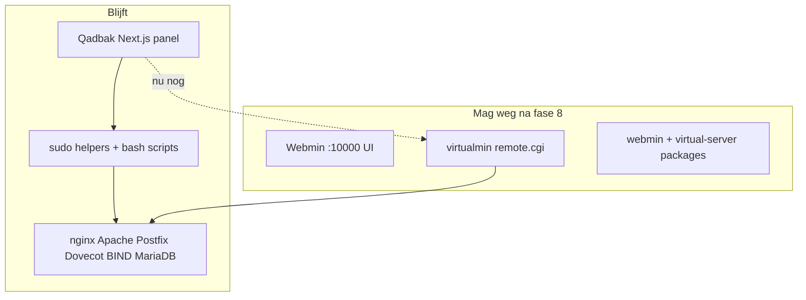

# VirtualMin/Webmin verwijderen — wat Qadbak nog nodig heeft

Je VPS na **phase 8 hybrid** (`provisioner: hybrid`):

| Laag | Status |
|------|--------|
| **Panel UI** | Qadbak — geen Webmin-tab (`QADBAK_DISABLE_WEBMIN=true`) |
| **Domeinlijst** | `data/native-domains.json` — geen `list-domains` API nodig |
| **Files, terminal, website repair, stack, host metrics** | Eigen helpers — geen Webmin |
| **Mail, DNS, SSL, DB, cron, backups, nieuw domein, …** | Nog **VirtualMin `remote.cgi`** (`QADBAK_VIRTUALMIN_FALLBACK=true`) |

**VirtualMin/Webmin pakketten verwijderen** mag pas als elke functie die je in het panel gebruikt een **native implementatie** heeft. De Linux-stack (nginx, Apache, Postfix, Dovecot, BIND, MariaDB) blijft altijd.

---

## Drie lagen (niet door elkaar halen)



---

## Checklist: native vervanging per gebied

Prioriteit voor **één testdomein** (`siccamanagement.nl`) — daarna pas `apt remove`.

| Gebied | Nu op VPS | Native nodig | Richting in repo |
|--------|-----------|--------------|------------------|
| Domeinlijst | hybrid JSON | ✅ klaar | `native-domains.json` |
| Website / vhost | Qadbak nginx scripts | ✅ grotendeels | `apply-customer-nginx-vhosts.sh`, `fix-domain-website.sh` |
| Bestanden | `domain-fs-helper` | ✅ klaar | — |
| Terminal | `qadbak-terminal` WS | ✅ klaar | — |
| SSL Let's Encrypt | native `ssl` flag | 🟡 | `certbot` — test op VPS |
| DNS records | native `dns` flag | 🟡 | `.hosts` zone files — test panel |
| Mail mailboxen | native `mail` direct | 🟡 | Postfix `virtual` + Maildir — test create/list |
| Databases | native `db` flag | 🟡 | `mysql` root — test panel |
| Cron | native `cron` flag | 🟡 | `crontab -u` |
| Backups | native `backup` flag | 🟡 | `~/backups/*.tar.gz` |
| Nieuw/verwijder domein | native `domain` | ✅ | `domain-create` / `domain-delete` (+ sub/alias) |
| Proxies | native `proxies` | ✅ | nginx `proxies.json` |
| Scripts (WP, …) | native `scripts` | ✅ | ZIP installers onder `public_html` |
| Spam/DKIM | native `security` | 🟡 | OpenDKIM + SpamAssassin (host packages) |
| Resellers/plannen | native `resellers` | 🟡 | JSON registry (metadata) |
| PHP versie / pool | native `php` | 🟡 | host PHP layout |
| FTP accounts | native `ftp` | 🟡 | proftpd-oriented |
| Admin server status | Qadbak + systemctl | ✅ grotendeels | `host-services-helper` |

🔴 = blokkeert package removal voor dagelijks gebruik  
🟡 = deels  
🟢 = alleen als je die admin-schermen gebruikt

Zie [PARITY-AUDIT.md](./PARITY-AUDIT.md) voor het volledige menu.

---

## Wat je al hebt (geen tweede “eigen panel” bouwen)

- **Panel** = Qadbak (auth, RBAC, UI) — dat *is* je eigen panel.
- **Provisioner** = plug-in: `virtualmin` → `hybrid` → `native`.
- **Stack** = bestaande OS-diensten, bestuurd door scripts (fase 5–6).

Je bouwt geen Webmin-kloon; je vervangt **remote.cgi-aanroepen** door **gevalideerde scripts** (zoals Hestia `v-add-domain`).

---

## Stappen op `vmi3317912` (veilig)

### Nu (gedaan / bezig)

```bash
curl -s http://127.0.0.1:3000/api/health
# provisioner: hybrid

# Panel: Domains, Files, Terminal — zonder Webmin-tab
# Mail/DNS/SSL: werken nog via VM API op de achtergrond
```

### Volgende ontwikkeling (repo) — **geïmplementeerd als sub-fases**

Zie [NATIVE-PHASES.md](./NATIVE-PHASES.md).

| Sub-fase | Commando op VPS |
|----------|-----------------|
| 8a SSL | `sudo bash scripts/apply-phase8-native-phase.sh ssl` |
| 8b DNS | `... phase.sh ssl,dns` |
| 8c domain | `... domain` |
| 8d mail | `... mail` (CLI, geen API) |
| 8e db | `... db` |
| 8f backup | `... backup` |
| 8g cron | `... cron` |
| Alles | `sudo bash scripts/apply-phase8-native-enable.sh` |

```bash
bash scripts/audit-vm-dependency.sh
sudo bash scripts/test-native-provisioning.sh
```

Wanneer alles getest: `QADBAK_VIRTUALMIN_FALLBACK=false`, `QADBAK_PROVISIONER=native`.

### Pas daarna: pakketten eraf (irreversibel zonder backup)

```bash
# Alleen als mail/DNS/create-domain native getest zijn!
sudo systemctl stop webmin
sudo apt remove webmin webmin-virtual-server virtualmin-*   # exacte pakketnamen per OS
sudo bash scripts/export-native-domains.sh   # laatste export vóór uninstall
```

Backup eerst: `/home`, `/etc/nginx`, `/etc/postfix`, `/etc/bind`, databases.

---

## Inschatting

| Scope | Tijd (indicatie, 1 dev) |
|-------|-------------------------|
| Geen Webmin UI (fase 1–8 hybrid) | ✅ op test-VPS |
| Mail + DNS + SSL native voor 1 domein | 2–4 maanden |
| Volledige v1-pariteit zonder VM | 12–24 maanden |
| `apt remove webmin` veilig op productie | na parity + migratie |

---

## E2E / preflight

Phase 8 preflight gebruikt `test-native-domains.sh`, niet `list-domains`. Na `git pull`:

```bash
sudo -u qadbak bash scripts/v1-test-preflight.sh
```

Zie [PHASE-8-NATIVE.md](./PHASE-8-NATIVE.md) · [QADBAK-INDEPENDENCE-8-PHASES.md](./QADBAK-INDEPENDENCE-8-PHASES.md).
